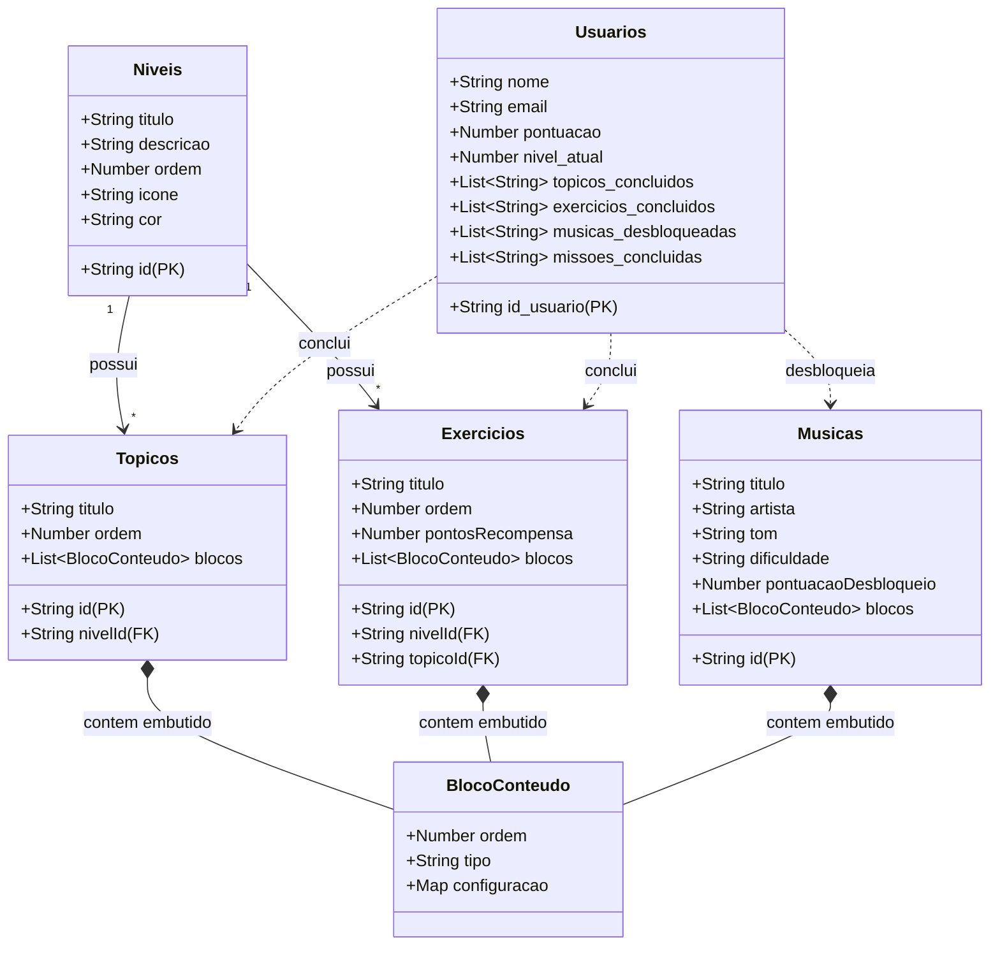

```mermaid
classDiagram
    direction TB

    class Niveis {
        +String id (PK)
        +String titulo
        +String descricao
        +Number ordem
        +String icone
        +String cor
    }

    class Topicos {
        +String id (PK)
        +String nivelId (FK)
        +String titulo
        +Number ordem
        +List~BlocoConteudo~ blocos
    }

    class Exercicios {
        +String id (PK)
        +String nivelId (FK)
        +String topicoId (FK)
        +String titulo
        +Number ordem
        +Number pontosRecompensa
        +List~BlocoConteudo~ blocos
    }

    class Musicas {
        +String id (PK)
        +String titulo
        +String artista
        +String tom
        +String dificuldade
        +Number pontuacaoDesbloqueio
        +List~BlocoConteudo~ blocos
    }

    class BlocoConteudo {
        +Number ordem
        +String tipo
        +Map configuracao
    }

    class Usuarios {
        +String id_usuario (PK)
        +String nome
        +String email
        +Number pontuacao
        +Number nivel_atual
        +List~String~ topicos_concluidos
        +List~String~ exercicios_concluidos
        +List~String~ musicas_desbloqueadas
        +List~String~ missoes_concluidas
    }

    Niveis "1" --> "*" Topicos : possui
    Niveis "1" --> "*" Exercicios : possui
    Topicos *-- BlocoConteudo : contem embutido
    Exercicios *-- BlocoConteudo : contem embutido
    Musicas *-- BlocoConteudo : contem embutido
    Usuarios ..> Topicos : conclui
    Usuarios ..> Exercicios : conclui
    Usuarios ..> Musicas : desbloqueia
```